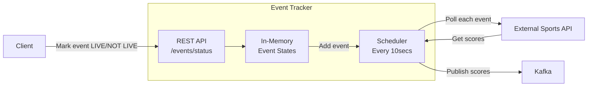

# live-events-microservice

This demo application showcases how to build a Java microservice using the following tools:
- Java 21
- Gradle
- Spring Boot
- Mocked external REST service
- Thread-safe in-memory state storage
- Multi-threaded scheduler
- Kafka

## How it works



The External Sports API is an internally mocked service, but it can also be a Postman Mock server (check application.yaml).
The Postman service should be available since it was created as public and can handle a considerable number of requests.
If you want to change the behavior of the mock server, simply add it to your instance from the postman folder and change the URL in the app config.

## How to set it up
### Prerequisites
- Docker 24+ installed
- Java 21+ installed

## How to run the app
1. Clone the project
2. Start Kafka and Zookeeper with Docker
```bash
cd kafka
docker-compose up -d
```
3. You can use the run configuration to build and run the app from IntelliJ --> it should be automatically parsed and available with the name "Application".
   Alternatively, you can run it from the CLI:
```bash
gradlew build
gradlew bootRun
```
4. You can use the pre-configured Postman collection in the postman folder to send valid and invalid requests to the running app

## How to run the tests
```bash
gradlew test
```
This should produce an HTML file with the test results.

## Architecture
### Implementation
- Used Gradle wrapper to make it easier to run the app
- Used Spring Boot for flexibility and quick development options with auto-configurations
- ConcurrentHashMap is used to store the internal state, ensuring thread-safety
    - Read operations are lock-free, and write performance is fairly good
- External API polling is done on different threads, so there is no blocking in the system
- Kafka is used for score publishing to learn something new :)

### Testing
- BDD: Tried to verify the behavior as much as possible, instead of writing assertions on program state
- Followed the Given-When-Then approach for the written tests

### Used AI assistance - 'Claude Sonnet 4.0 Thinking' model
- Generated the Mermaid diagram at the top of this file
- Initial Kafka setup (Producer and listeners) -> further improved after reading about Kafka

## Verification
- Checked logs in the Docker containers
- Checked app logs with detailed logging
- Verified that the topic exists after manual testing
```bash
docker exec kafka-kafka-1 kafka-topics --bootstrap-server kafka:9092 --list
```
Output: "sports-events"
- Tested with different network delays to reach the timeout limit (Postman mock server)
- Tested with valid and invalid requests using Postman
- Ran written tests

# Further improvements / TODOs
- Add more tests for retries
- Implement dead letter queue configuration
- Publish JSON messages to Kafka