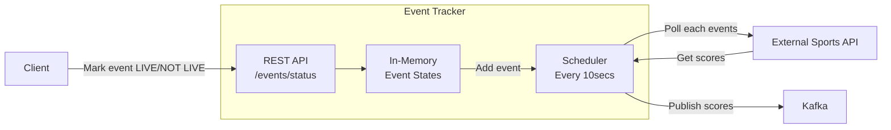

# live-events-microservice

This demo application showcases how to build a Java microservice using the following tools:
- Java 21
- Gradle
- Spring Boot
- Mocked external REST service
- Thread-safe in-memory state storage
- Multi-threaded scheduler
- Kafka

## How it works


External Sports API is an internally mocked service, but it can be a Postman Mock server as well (check application.yaml). 
The Postman service itself should be available since created as public. It can handle considerably good amount of requests. 
If you want to change the behaviour of the mock server, just add it to your instance from the postman folder and change the url in the app config.

## How to set it up
### Prerequirements
- Docker 24+ installed
- Java 21+ installed

## How to run the app
1. Clone project
2. Start Kafka and Zookeeper with Docker
```bash
cd kafka
docker-compose up -d
```
3. You can use the run config to build and run the app from IntelliJ --> should be automatically parsed and available win the name "Application".
Or you can run it from CLI
```bash
gradlew build
gradlew bootRun
```
4. You can use the pre-configured Postman collection in the postman folder to shoot valid and invalid requests towards the running app


## How to run the tests
```bash
gradlew test
```
It should produce a html file with the test results.

## Architecture
### Implementation
- Used Gradle wrapper to make it easier to run the app
- Used Spring Boot so it gives flexibility and quick development options with auto-configurations 
- ConcurrentHashMap used to store the internal state so thread-safety is ensured
  - Read operations as lock-free, write performance is fairly good
- External API polling is done on different threads so there is no blocking in the system
- Kafka used for score publishing to learn something new :)

### Testing
- BDD: Tried to verify the behaviour as much as it is possible, instead of writing assertations on program state
- Followed the Given-when-Then approach for the written tests

### Used AI assistance - 'Calude Sonnet 4.0 Thinking' model
- Generated the Mermaid diagram at the top of this file
- Initial Kafka setup (Producer and listeners) -> further improved after reading about Kafka

## Verification
- Checked logs in the docker containers
- Checked app logs with detailed logs
- Checked that the topic exists after manual testing
```bash
docker exec kafka-kafka-1 kafka-topics --bootstrap-server kafka:9092 --list
```
Prompted: "sports-events"
- Tested with different network delays to reach timeout limit (Postman mock server)
- Tested with valid and invalid requests using Postman
- Written tests

# Further improvements / TODOs
- Add more tests for retries
- Implement dead letter queue config
- Publish JSON messages to Kafka


