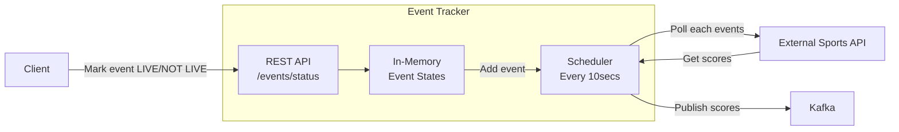

# live-events-microservice

This is a demo application to demonstrate How a Java microservice can be implemented with the following tools:
- Spring Boot
- Thread-safe in-memory state storage
- Scheduler with many threads
- Kafka

## What it does


External Sports API is a Postman Mock server. That should be available since created as public. It can handle considerably good amount of requests.

## How to set it up

### Prerequirements
- Docker 24+ installed
- Java 21+ installed

## How to run the app
1. Start Kafka and Zookeeper using the Docker compose
```bash
cd kafka
docker-compose up -d
```
2. Build and Run the app
You can use the run config from IntelliJ --> should be automatically parsed and available win the name "Application"
Or you can run it from CLI
```bash
gradlew build
gradlew bootRun
```
3. You can use the pre-configured Postman collection in the postman folder to test


## How to run the tests
```bash
gradlew test
```

## Architecture


## Verification
- Checked logs in the docker containers
- Checked that the topic exists after manual testing
```bash
docker exec kafka-kafka-1 kafka-topics --bootstrap-server kafka:9092 --list
```
Prompted: sports-events


